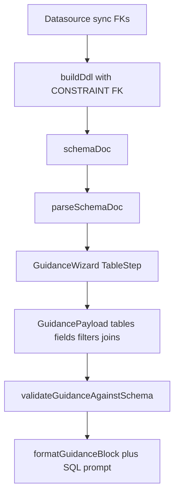

# Guidance Related-Table Queries Implementation Plan

> **For agentic workers:** REQUIRED SUB-SKILL: Use superpowers:subagent-driven-development (recommended) or superpowers:executing-plans to implement this plan task-by-task. Steps use checkbox (`- [ ]`) syntax for tracking.

**Goal:** Enable guidance-mode multi-table queries via primary + direct FK-related tables, with auto INNER JOINs from `schemaDoc` FOREIGN KEY metadata.

**Architecture:** Sync introspects FKs into `schemaDoc` DDL; `@ai-bi/shared` parses relations and builds joins; the wizard nests related-table multi-select in the table step and submits qualified fields + `joins[]`; the agent prompt block requires those JOINs.

**Tech Stack:** TypeScript monorepo (`@ai-bi/shared`, NestJS API, Next.js web), `node:test` + `tsx`, class-validator DTOs, Phosphor icons, existing Tailwind tokens.

**Spec:** [docs/superpowers/specs/2026-09-09-guidance-related-tables-design.md](docs/superpowers/specs/2026-09-09-guidance-related-tables-design.md)

**Canonical plan copy (on execute):** also write/sync this plan to `docs/superpowers/plans/2026-09-09-guidance-related-tables.md` to match repo convention.

## Global Constraints

- Relation source: FOREIGN KEY only (no naming heuristics, no browse-all).
- Related candidates: **direct** FK neighbors of primary only (no multi-hop).
- Join type: `INNER` only; `GuidancePayload.tables[0]` is primary.
- New submits: fields/filters always `table.column`; `joins: []` for single-table.
- Wizard stays 3 steps; related UI only inside 表 step; hide related section when no neighbors.
- Re-sync Schema required for existing datasources to populate FKs.
- Do not implement LEFT JOIN, user-edited join keys, or Lab relation graph UI.

## File map

| File | Role |
|------|------|
| Modify [packages/shared/src/guidance-types.ts](packages/shared/src/guidance-types.ts) | `SchemaRelationMeta`, `GuidanceJoin`, extend payload/table meta |
| Modify [packages/shared/src/schema-enum.ts](packages/shared/src/schema-enum.ts) | `SchemaForeignKeyRow` + `buildDdl` FK lines |
| Modify [packages/shared/src/schema-parse.ts](packages/shared/src/schema-parse.ts) | Parse FK constraints into `outgoingRelations` |
| Create [packages/shared/src/schema-relations.ts](packages/shared/src/schema-relations.ts) | `collectRelations`, `relatedTablesFor`, `buildJoins`, `validateGuidanceAgainstSchema` |
| Modify [packages/shared/src/index.ts](packages/shared/src/index.ts) | Re-export relations module |
| Tests under `packages/shared/src/*.test.ts` | DDL/parse/relations coverage |
| Modify [apps/api/src/datasource/datasource.service.ts](apps/api/src/datasource/datasource.service.ts) | PG/MySQL FK introspection → `buildDdl` |
| Modify [apps/api/src/chat/chat.dto.ts](apps/api/src/chat/chat.dto.ts) + test | `GuidanceJoinDto`, optional `joins` |
| Modify [apps/api/src/chat/chat.service.ts](apps/api/src/chat/chat.service.ts) | Validate guidance joins vs schema before stream |
| Create [apps/api/src/agent/graph/guidance-format.ts](apps/api/src/agent/graph/guidance-format.ts) | Extract `formatGuidanceBlock` for testability |
| Modify [apps/api/src/agent/graph/nodes.ts](apps/api/src/agent/graph/nodes.ts) + [prompts.ts](apps/api/src/agent/graph/prompts.ts) | Use new format + JOIN rules |
| Modify web guidance components under [apps/web/app/chat/[sessionId]/_components/guidance/](apps/web/app/chat/[sessionId]/_components/guidance/) | UI + message builder |
| Modify [apps/web/lib/guidance-summary.test.ts](apps/web/lib/guidance-summary.test.ts) | Message / column tests |



---

### Task 1: Shared types + `buildDdl` FK emission

**Files:**
- Modify: `packages/shared/src/guidance-types.ts`
- Modify: `packages/shared/src/schema-enum.ts`
- Modify: `packages/shared/src/schema-enum.test.ts`

**Interfaces:**
- Produces:
  - `SchemaRelationMeta`, `GuidanceJoin`, `GuidancePayload.joins`, `SchemaTableMeta.outgoingRelations?`
  - `SchemaForeignKeyRow = { constraint_name, from_table, from_column, to_table, to_column, ordinal_position }`
  - `buildDdl(rows, enumMap?, foreignKeys?: SchemaForeignKeyRow[]): string`

- [ ] **Step 1: Write failing `buildDdl` FK test** in `schema-enum.test.ts` asserting DDL contains `CONSTRAINT fk_orders_user FOREIGN KEY (user_id) REFERENCES users (id)` (and a composite FK case grouped by `constraint_name` ordered by `ordinal_position`).

- [ ] **Step 2: Run** `pnpm --filter @ai-bi/shared test` — expect FAIL.

- [ ] **Step 3: Add types + extend `buildDdl`** to append one `CONSTRAINT … FOREIGN KEY (cols) REFERENCES table (cols)` line per constraint after column lines; skip incomplete groups.

- [ ] **Step 4: Re-run shared tests — PASS. Commit** `feat(shared): emit FOREIGN KEY constraints in schemaDoc DDL`

---

### Task 2: Parse FK lines + relation helpers

**Files:**
- Modify: `packages/shared/src/schema-parse.ts`, `schema-parse.test.ts`
- Create: `packages/shared/src/schema-relations.ts`, `schema-relations.test.ts`
- Modify: `packages/shared/src/index.ts`

**Interfaces:**
- Consumes: Task 1 types / DDL shape
- Produces:
  - `parseSchemaDoc` fills `outgoingRelations` on FK-holding tables
  - `collectRelations(tables: SchemaTableMeta[]): SchemaRelationMeta[]`
  - `relatedTablesFor(tables, primary): { table: string; relation: SchemaRelationMeta; hint: string }[]` (bidirectional direct edges; `hint` like `user_id → users.id`)
  - `buildJoins(primary, related: string[], tables): GuidanceJoin[]` (throws or returns only valid; callers use validate for API)
  - `validateGuidanceAgainstSchema(schemaDoc: string, payload: GuidancePayload): { ok: true } | { ok: false; error: string }`

**Rules for helpers:**
- Neighbor if relation connects primary↔other (either direction).
- `GuidanceJoin` maps FK columns as stored (`from*` / `to*` onto `left*` / `right*` preserving constraint direction).
- Reject related names with no direct edge; reject `tables[1+]` not in neighbor set; reject joins that do not match a known edge; require `tables[0]` present in schema.

- [ ] **Step 1: Failing tests** — parse single + composite FK; `relatedTablesFor` both directions; `buildJoins` happy path; `validateGuidanceAgainstSchema` rejects non-neighbor and mismatched join.

- [ ] **Step 2: Implement parse** — when scanning DDL body lines, match `FOREIGN KEY (...) REFERENCES ... (...)` (with optional `CONSTRAINT name`); attach to current table’s `outgoingRelations` (do not treat as columns). Update existing test that skipped FK lines so columns still exclude constraint-only lines but relations are populated.

- [ ] **Step 3: Implement `schema-relations.ts` + export from index.**

- [ ] **Step 4: Tests PASS. Commit** `feat(shared): parse FKs and build guidance joins`

---

### Task 3: Datasource sync FK introspection (PG + MySQL)

**Files:**
- Modify: `apps/api/src/datasource/datasource.service.ts`
- Prefer unit-testable private helpers or extract query+map pure functions if easy; otherwise add a focused test module with mocked query rows if the service is hard to unit-test — minimum: ensure `buildDdl(..., foreignKeys)` is called with mapped rows (extract `mapPgForeignKeyRows` / `mapMysqlForeignKeyRows` pure helpers into the same file or a small `schema-fk.ts` next to the service and test those).

**Postgres query (public schema):** join `table_constraints` (`FOREIGN KEY`), `key_column_usage`, `constraint_column_usage` (or equivalent) ordered by constraint + ordinal; map to `SchemaForeignKeyRow`.

**MySQL query:** `KEY_COLUMN_USAGE` where `REFERENCED_TABLE_NAME IS NOT NULL` for current schema; map similarly.

- [ ] **Step 1: Write failing tests** for row→`SchemaForeignKeyRow` mappers (fixture rows → expected arrays including composite).

- [ ] **Step 2: Implement fetch + pass `foreignKeys` into `buildDdl` in both `extractPostgresSchema` and `extractMysqlSchema`.

- [ ] **Step 3: Tests PASS. Commit** `feat(api): sync FOREIGN KEY metadata into schemaDoc`

---

### Task 4: Chat DTO, join validation, agent formatting

**Files:**
- Modify: `apps/api/src/chat/chat.dto.ts`, `chat.dto.test.ts`
- Modify: `apps/api/src/chat/chat.service.ts`
- Create: `apps/api/src/agent/graph/guidance-format.ts`, `guidance-format.test.ts`
- Modify: `apps/api/src/agent/graph/nodes.ts`, `prompts.ts`

**DTO shape:**

```ts
class GuidanceJoinDto {
  @IsString() leftTable!: string;
  @IsArray() @IsString({ each: true }) leftColumns!: string[];
  @IsString() rightTable!: string;
  @IsArray() @IsString({ each: true }) rightColumns!: string[];
  @IsIn(['INNER']) type!: 'INNER';
}
// On GuidancePayloadDto:
@IsOptional() @IsArray() @ValidateNested({ each: true }) @Type(() => GuidanceJoinDto)
joins?: GuidanceJoinDto[];
```

**chat.service:** when `dto.guidance` present, load datasource `schemaDoc`, run `validateGuidanceAgainstSchema`; on failure `throw new BadRequestException(error)`.

**formatGuidanceBlock:** move from `nodes.ts` into `guidance-format.ts`; include lines for joins e.g. `JOIN：orders.user_id = users.id (INNER)` (composite: AND within one join).

**prompts.ts:**
- Planner rule: if guidance present, `relevant_tables` must include all `guidance.tables`.
- SQL rules: if guidance lists JOINs, emit those INNER JOINs and do not rewrite join keys; prefer qualified columns from guidance fields/filters.

- [ ] **Step 1: Failing DTO + format + (optional) service validation unit tests.**

- [ ] **Step 2: Implement DTO, validation hook, format extract, prompt updates, wire `nodes.ts`.**

- [ ] **Step 3: Run** `pnpm --filter @ai-bi/api test` (or project’s api test script) — PASS. Commit `feat(api): validate guidance joins and prompt INNER JOINs`

---

### Task 5: Web guidance summary helpers

**Files:**
- Modify: `apps/web/app/chat/[sessionId]/_components/guidance/guidance-summary.ts`
- Modify: `apps/web/lib/guidance-summary.test.ts`

**Changes:**
- `buildGuidanceMessage`: if `payload.tables.length > 1` or `joins.length > 0`, use form  
  `基于表 {primary}（关联 {rest}），关联 {joinEquals}，字段 …，条件 …，原问题：…`  
  Single-table + empty joins: keep existing shape but fields may be qualified (`orders.gmv`) — update expectations accordingly (locked: **always qualify** on new payloads).
- Add `qualifyField(table, column) => \`${table}.${column}\`` helper used by wizard.
- Keep `columnsForTables` returning `{ table, name, type }` (already multi-table capable).

- [ ] **Step 1: Update/extend failing tests** for multi-table association sentence and join clause; single-table with `joins: []`.

- [ ] **Step 2: Implement message builder.**

- [ ] **Step 3: PASS. Commit** `feat(web): include joins in guidance resubmit summary`

---

### Task 6: GuidanceWizard UI (Table / Field / Filter / readonly)

**Files:**
- Modify: `GuidanceWizard.tsx`, `TableStep.tsx`, `FieldStep.tsx`, `FilterStep.tsx`
- Import helpers from `@ai-bi/shared` (`relatedTablesFor`, `buildJoins`)

**GuidanceWizard state:**
- `primary: string | null`
- `related: string[]`
- On primary change: clear `related`, `fields`, `filters`
- Submit:
  ```ts
  const tables = primary ? [primary, ...related] : [];
  const joins = buildJoins(primary!, related, intent.tables);
  const payload = { tables, fields, filters: filters.filter(f => f.field), joins };
  ```
- Pass `selectedTables={tables}` (or primary+related) into Field/Filter steps.

**TableStep:** after primary selected, if `relatedTablesFor(...).length > 0`, render `fieldset` 「可关联表（可选）」 with helper copy 「根据外键自动关联，可多选」, chips, checkbox list with `hint`, `max-h` scroll, `motion-safe` fade. No neighbors → render nothing extra.

**FieldStep:** accept `selectedTables: string[]`; group by table; checkbox values `table.column`; label primary group 「主表」.

**FilterStep:** `optgroup` per table; field values qualified.

**GuidanceSummaryReadonly:** if `selection.joins?.length`, show chips `left → right` (table names).

- [ ] **Step 1: Implement UI wiring** (manual browser check: no FK → unchanged; with FK fixture schemaDoc in Lab/guidance → related section appears).

- [ ] **Step 2: Commit** `feat(web): multi-table related selection in guidance wizard`

---

### Task 7: Regression + operator note

**Files:**
- Fix any broken shared/api/web tests from `joins` required on `GuidancePayload` (use `joins: []` in fixtures).
- Optionally one-line note in admin datasources UI near sync button: 「关联表引导需重新同步 Schema 以加载外键」 — only if a low-churn copy spot exists on [apps/web/app/admin/datasources/page.tsx](apps/web/app/admin/datasources/page.tsx); otherwise document in commit message / spec status only (prefer small UI hint).

- [ ] **Step 1: Run** `pnpm --filter @ai-bi/shared test`, api tests, `pnpm --filter @ai-bi/web test`.

- [ ] **Step 2: Commit** `test: regress guidance joins and document schema re-sync`

---

## Spec coverage checklist

| Spec item | Task |
|-----------|------|
| Types + payload joins | 1 |
| buildDdl FK | 1 |
| parseSchemaDoc relations | 2 |
| relatedTablesFor / buildJoins / validate | 2 |
| PG/MySQL sync | 3 |
| DTO + 400 validation | 4 |
| Agent format + prompts | 4 |
| buildGuidanceMessage | 5 |
| 3-step UI related nested in table | 6 |
| Field/filter grouping + qualify | 6 |
| Readonly join chips | 6 |
| Re-sync / regression | 7 |
| Non-goals excluded | Global Constraints |

## Self-review notes

- No multi-hop, heuristics, or LEFT JOIN in any task.
- `GuidancePayload.joins` treated as required in TS; HTTP DTO keeps `joins?` and service normalizes missing → `[]` before validate/agent.
- Field qualification always on new submits (updates existing web tests).
